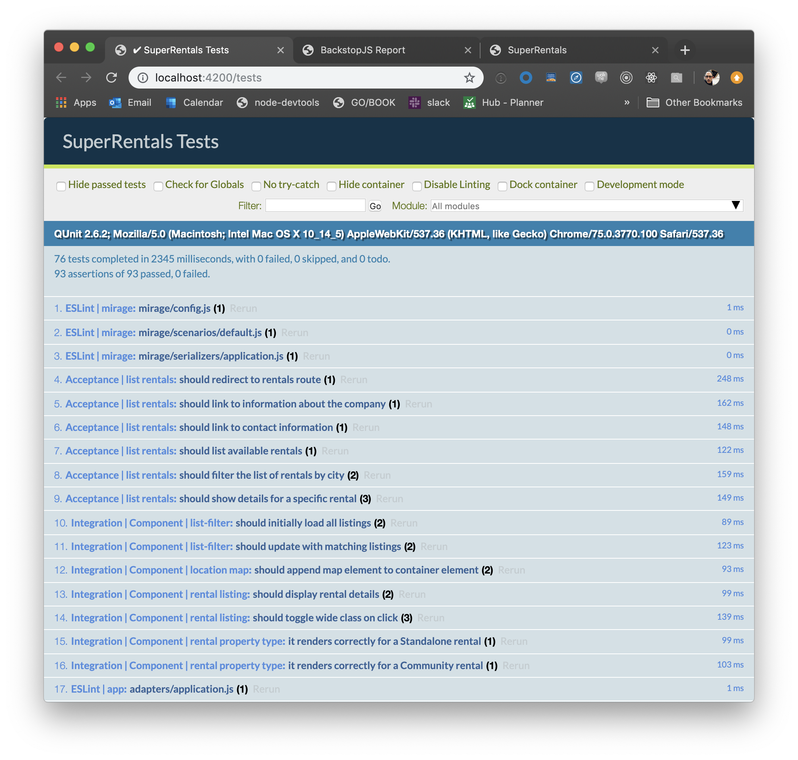
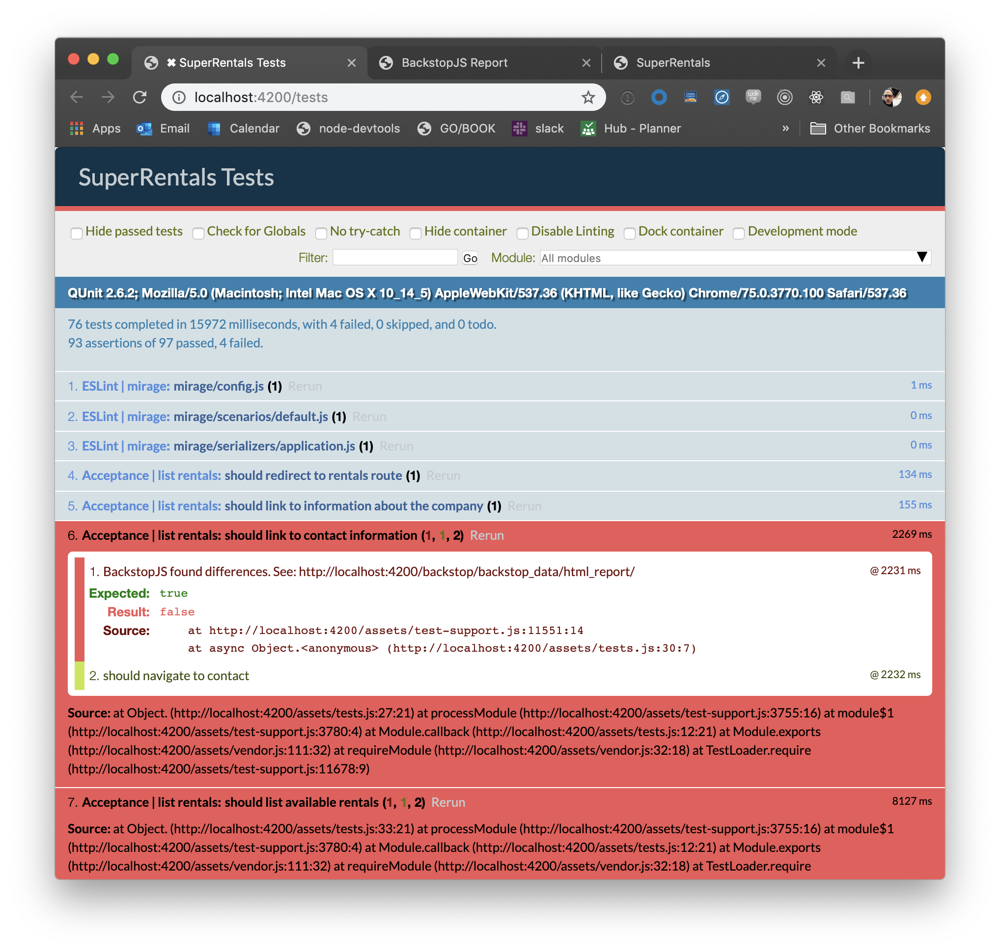
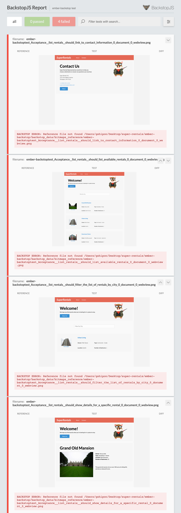
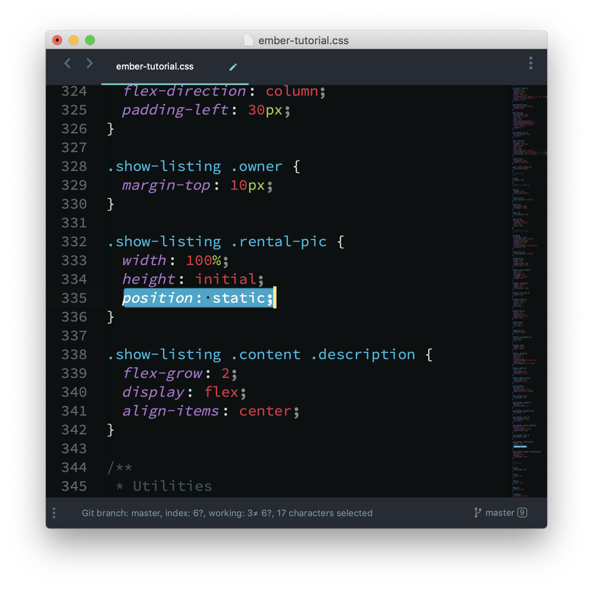
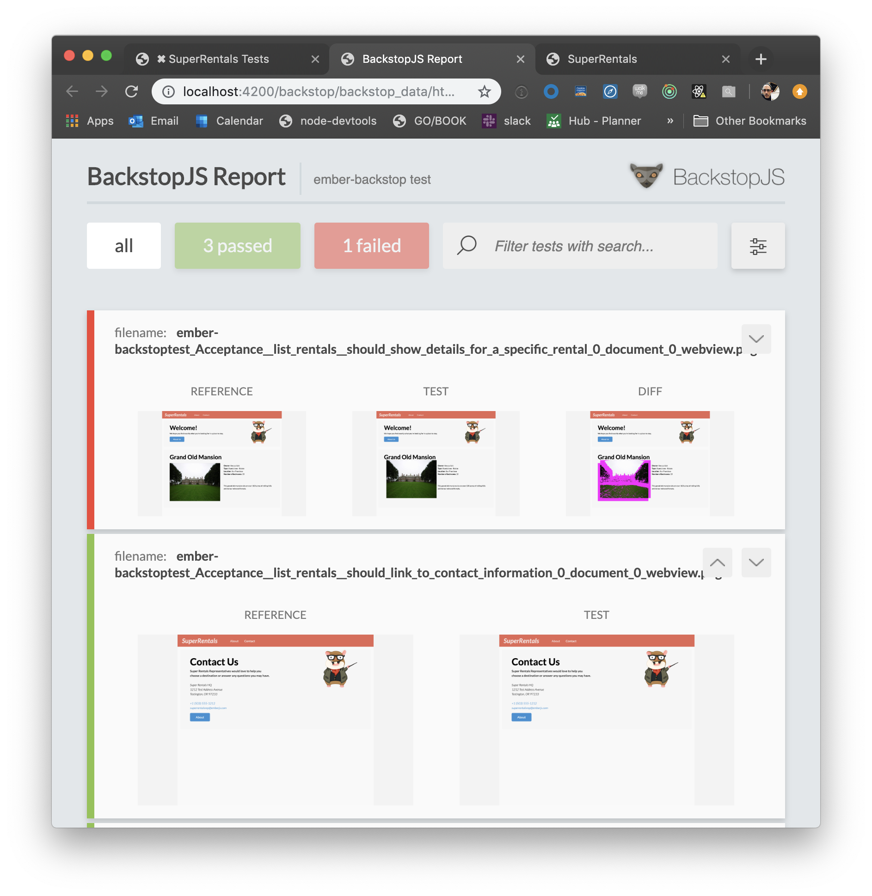

# Ember-Backstop Visual Test-Helper Tutorial

The [ember-backstop test-helper addon](https://github.com/garris/ember-backstop) makes it **wicked easy** for you to add powerful visual tests to your ember app.  This tutorial is designed to show you how in *about 5 minutes*.

This tutorial starts with a fork of the EmberJS [Super Rentals](https://guides.emberjs.com/current/tutorial/ember-cli/) tutorial. We added the [ember-backstop](https://github.com/garris/ember-backstop) test helper to the project and configured everything for you so you can get right in and experience visual testing with everything all set up. Awesome.

## Prerequisites

You will need the following things properly installed on your machine.

* [Git](https://git-scm.com/)
* [Node.js](https://nodejs.org/)
* [Yarn](https://yarnpkg.com/)
* [Ember CLI](https://ember-cli.com/)
* [Google Chrome](https://google.com/chrome/)

## Installation

First, find a spot on your machine where you want to put the demo -- desktop works fine...

```
git clone https://github.com/garris/ember-backstop-tutorial/
cd ember-backstop-tutorial
yarn install
```

## Start Backstop-Remote Service and Ember Server
In the project root run the following to start the Backstop-Remote service...

```
ember backstop-remote
```

Then, in another window start ember...

```
ember serve
```

Ok, let's get to the tests!

## Add Visual Regression Tests

### Start by running the original (old-school) tests

So, by now your server is running and the demo app will be hittable at [http://localhost:4200](http://localhost:4200).  Go ahead and click around there. We'll wait...

The ordinary Ember tests are here, all set up for you -- [http://localhost:4200/tests](http://localhost:4200/tests). Go ahead hit that link and watch everything run.  Here is the testem test report that you should see...



### Next, set-up the ember-backstop test helper

First, open `tests/acceptance/list-rentals-test.js` and add the following import statement to the top of the file...

```
import backstop from 'ember-backstop/test-support/backstop';
```

... and here is an example of how you add the screenshot helper to your tests...

```
  test('it renders the thing', async function(assert) {
    await visit('/sales/company/11102');
    await backstop(assert);
    assert.dom('#myFancyElement').Exists();
  });
```

Go ahead and add it to the last four tests inside `tests/acceptance/list-rentals-test.js` as shown below...


Ok, the helper is set up -- let's now set up the visual tests.

### Setting up ember-backstop tests

The first time you run an ember-backstop after set-up the test will fail -- so go ahead! Fail fast! Rerun your testem tests -- it should look like below...



Testem is showing failed BackstopJS tests -- which have failed because we have not yet told BackstopJS what our reference images should look like. Let's fix that -- open the BackstopJS report in a browser tab [http://localhost:4200/backstop/backstop_data/html_report/](http://localhost:4200/backstop/backstop_data/html_report/)

That should look like this...


These test screenshots look good -- lets tell backstop to approve them which will remove our error state here and ensure that future test screenshots will be compared against these.  

In another window approve the tests with...

```
ember backstop-approve
```

Now run tests again (refresh [http://localhost:4200/tests](http://localhost:4200/tests)) -- they should all pass!  

When the testem tests (above) have completed go ahead and refresh the Backstop report here [http://localhost:4200/backstop/backstop_data/html_report/](http://localhost:4200/backstop/backstop_data/html_report/).  It should look like this...


**Congratulations! BackstopJS tests are all set up!**  Just add a `backstop()` helper anywhere and a screenshot will capture the rendered visual state at that time.

Go forth now and experiment with your new visual powers! 

As a suggestion you could open up the project css file at `vendor/ember-tutorial.css`. Go ahead and delete the `postion: static;` as shown in the following file. See if BackstopJS can find the changes... 😉



The above changes is caught by BackstopJS...



## Further Reading / Useful Links

* [BackstopJS](http://backstopjs.org)
* [ember-backstop addon helper for Ember apps](https://github.com/garris/ember-backstop)
* [ember.js](https://emberjs.com/)
* [ember-cli](https://ember-cli.com/)
